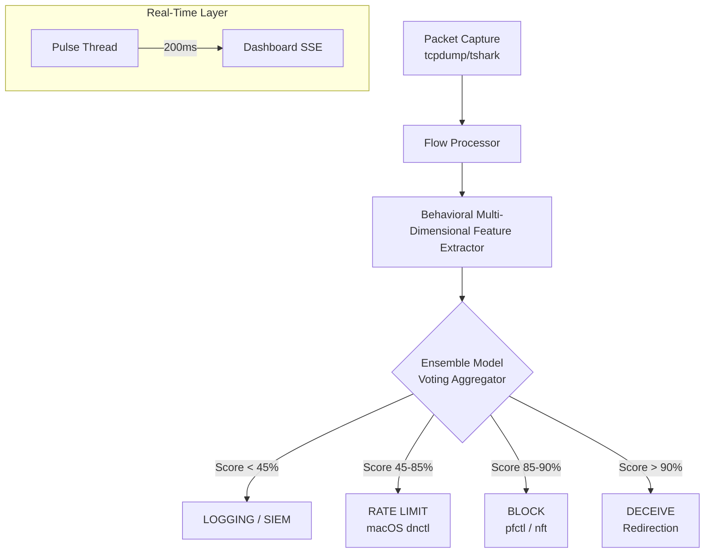

# 🛡️ INTELLIGENT SELF-DEFENDING NETWORK FRAMEWORK (ISDNF)
### *Next-Generation Autonomous SOC | V13.0.0 "Deception & Pulse"*

[](https://opensource.org/licenses/MIT)
[](https://www.python.org/downloads/)
[](#)

ISDNF is a high-performance, autonomous security operation center (SOC) prototype designed for real-time threat detection and deceptive active defense. By combining **packet-level telemetry**, **ML-driven anomaly detection**, and **automated layer-7 redirection**, ISDNF transforms passive monitoring into active survival.

---

## ⚡ Real-Time Intelligence (V13.0 Highlights)


*Figure 1: The V13.0 Intelligence Layer featuring sub-second "Live Pulse" telemetry.*

### 🚀 Ultra-Low Latency Telemetry
ISDNF V13.0 introduces a dedicated **200ms pulse monitor**. While traditional IDS wait seconds or minutes for batch analysis, ISDNF provides instantaneous visibility into:
- **PPS (Packets Per Second)**: Sub-second ingress surge detection.
- **Throughput (KB/s)**: Real-time network load visualization.

### 🎭 Deceptive Active Defense
Beyond simple IP blocking, ISDNF implements **"Honeypot Redirection"**. Highly malicious actors (Risk > 90%) are silently routed to a honey trap, allowing security teams to study adversary behavior without alerting the attacker of their discovery.


*Figure 2: Autonomous 'DECEIVE' action triggered against a high-risk source.*

---

## 🏗️ Architecture

ISDNF operates on a multi-stage pipeline designed for stability and speed.



---

## 🧠 ML Intelligence

The core of ISDNF is an **Ensemble Detection Engine** trained on **CIC-IDS2017** behavioral profiles. It evaluates 39 high-fidelity features including:
- Beaconing Interval Stability
- Payload Entropy
- Connection Persistence
- Volume-to-Interval Ratios


---

## 🛠️ Tech Stack
- **Languages**: Python (Backend), JavaScript (Frontend/State)
- **Frameworks**: Flask, Chart.js, TailwindCSS
- **ML/DS**: Scikit-Learn, Pandas, NumPy, Joblib
- **Networking**: Tshark, Pyshark, tcpdump
- **Defense Native APIs**: MacOS (pfctl/dnctl), Linux (nftables/iptables)
- **SIEM**: Wazuh XDR Integration (JSON Bridge)

---

## 🚀 Quick Start

### 1. Installation
```bash
git clone https://github.com/marmik/Network-Defence.git
cd Network-Defence
python3 -m venv .venv
source .venv/bin/activate
pip install -r requirements.txt
```

### 2. Launch Dashboard
```bash
python3 src/dashboard/app.py
```

### 3. Start Intelligence Engine
```bash
sudo python3 src/orchestrator.py --iface en0
```

---

## 📊 Performance Verification

#### Sub-second Pulse & High-Volume Pressure Handling
````carousel

<!-- slide -->

````

---
*Created by Marmik | Intelligent Self-Defending Network Framework*
