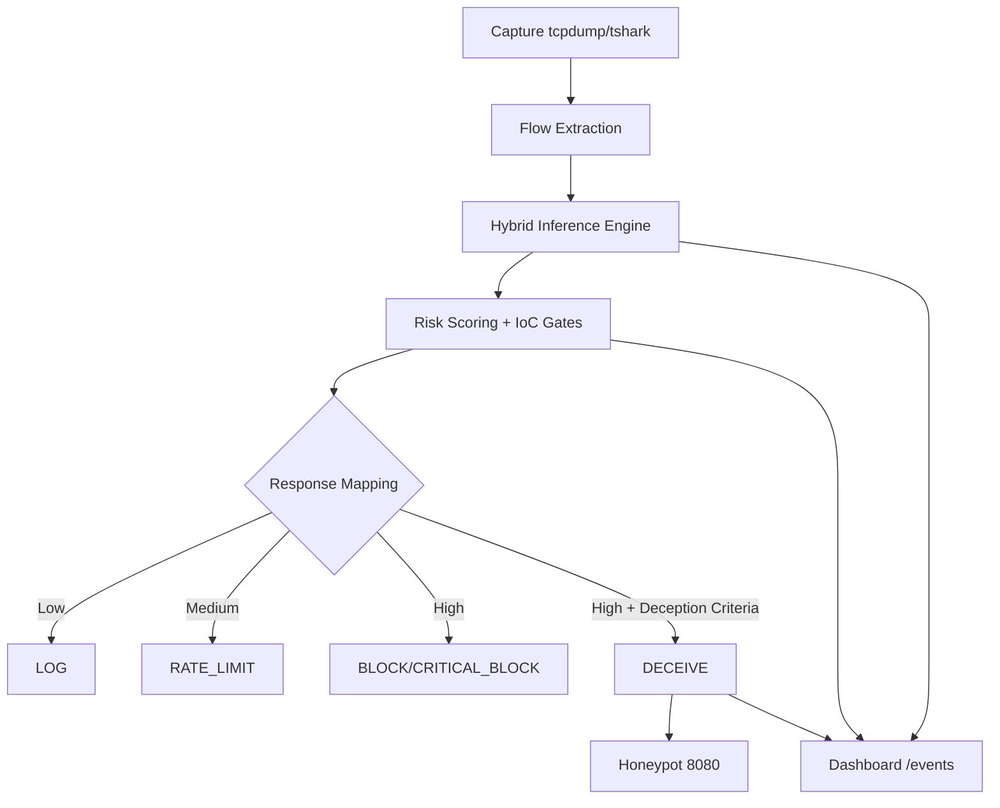

# INTELLIGENT SELF-DEFENDING NETWORK FRAMEWORK (ISDNF)

[](https://opensource.org/licenses/MIT)
[](https://www.python.org/downloads/)

ISDNF is a hybrid IDS + IPS framework for real-time flow-based anomaly detection, contextual threat scoring, and autonomous response.

This README documents the current `main` branch behavior and implementation details.

## Important Update: Firewall Stack

This project no longer documents or depends on `iptables` for its active defense path.

- On macOS, active controls are implemented via `pfctl` and `dnctl`.
- On Linux, active controls are implemented via `nft` (`nftables`).

Code reference: `src/defender.py`.

## What The System Does

- Captures live traffic with `tcpdump` (fallback to `tshark`).
- Converts PCAP traffic into flow features.
- Runs hybrid ML inference (DNN + optional HGB blend).
- Computes contextual risk using anomaly, intensity, persistence, and network context.
- Applies policy-based actions: `LOG`, `RATE_LIMIT`, `BLOCK`, `CRITICAL_BLOCK`, `DECEIVE`.
- Redirects high-confidence attacker traffic to a deception honeypot.
- Streams pulse, alert, and honeypot telemetry to a live dashboard.

## High-Level Pipeline



## Repository Components

- `src/orchestrator.py`
Orchestration loop (capture -> features -> infer -> risk -> enforce -> alert).

- `src/risk.py`
Risk model and action mapping with context-aware de-escalation logic.

- `src/defender.py`
Cross-platform enforcement engine.
    - macOS: `pfctl` tables/anchors + `dnctl` throttling.
    - Linux: `nft` rules/elements.

- `src/honeypot.py`
Deception web node and interaction logger.

- `src/dashboard/app.py`
Dashboard API and SSE event stream.

- `src/ml/high_perf_model.py`
Hybrid inference, probability calibration, payload side-signal generation.

- `src/packet_to_flow.py`
PCAP to flow conversion.

## Current Response Strategy

Response is not based on volume alone. It is evidence-gated.

- Strong scan IoCs include high port diversity, incomplete handshakes, and scan-like classification.
- Strong payload IoC includes high payload signal plus high anomaly.
- Escalation above `RATE_LIMIT` requires strong IoCs or sustained suspicious persistence.
- Private/internal IPs are treated conservatively unless clear attack evidence exists.
- Known infrastructure/datacenter traffic is de-escalated unless strong attack indicators are present.
- Deception (`DECEIVE`) is reserved for high-confidence attacker behavior.

### Brute-force Anti-Flood Escalation (Latest)

To reduce dashboard flood from repeated single-port brute-force traffic (for example Hydra on port `8080`):

- repeated `DECEIVE` cycles for single-port web-focused pressure are counted,
- after threshold cycles, action is auto-switched from `DECEIVE` to persistent `BLOCK`.

This logic is implemented in `src/orchestrator.py` and is intended to prevent endless trap-only spam during brute-force tests.

## Prerequisites

- Python `3.10+`
- `tshark` and/or `tcpdump`
- macOS (active mode): `pfctl`, `dnctl`
- Linux (active mode): `nft`

## Installation

```bash
git clone https://github.com/marmik/Network-Defence.git
cd Network-Defence
python3 -m venv .venv
source .venv/bin/activate
pip install -r requirements.txt
```

## Runbook

1. Start dashboard:

```bash
source .venv/bin/activate
python3 src/dashboard/app.py --host 0.0.0.0 --port 5010
```

2. Start honeypot:

```bash
source .venv/bin/activate
python3 src/honeypot.py
```

3. Start orchestrator (safe dry-run):

```bash
source .venv/bin/activate
python3 src/orchestrator.py --iface en0 --duration 3
```

4. Start orchestrator (active enforcement):

```bash
source .venv/bin/activate
sudo .venv/bin/python3 src/orchestrator.py --iface en0 --duration 3 --no-dry-run --honeypot-ip 127.0.0.1 --honeypot-port 8080
```

## Service Health Checks

```bash
curl -s http://127.0.0.1:8080/health
curl -s http://127.0.0.1:5010/stats
pgrep -af 'src/orchestrator.py'
```

## Dashboard Endpoints

- `GET /` main dashboard
- `GET /stream` SSE feed
- `POST /events` ingest pulse/alert/honeypot events
- `GET /alerts` alert history
- `GET /stats` cumulative counters and latest pulse
- `GET /ml/stats` model/training/drift summary
- `GET /honeypot` honeypot panel
- `GET /honeypot/hits` recent honeypot interactions
- `GET /honeypot/summary` honeypot aggregate stats
- `POST /honeypot/test` synthetic honeypot hit
- `POST /honeypot/test-burst` synthetic hit burst
- `POST /purge` reset runtime telemetry files

## Runtime Data and Artifacts

- Alerts/logs:
    - `alerts.json`
    - `cumulative_stats.json`
    - `honeypot_interactions.json`
    - `isdnf_siem.log`

- Capture outputs:
    - `captures/*.pcap`
    - `captures/*.flows.csv`

- ML artifacts (typical):
    - `models/cic_model_v1.pt`
    - `models/cic_scaler_v1.joblib`
    - `models/cic_label_encoder_v1.joblib`
    - `models/cic_features_v1.joblib`
    - `models/cic_hgb_model_v1.joblib` (optional)
    - `models/cic_calibration_v1.joblib`
    - `models/cic_calibration_v2.joblib`
    - `models/cic_priors_v1.joblib`
    - `models/cic_decision_metadata_v1.joblib`
    - `src/ml/plots/training_summary.json`

## Kali Test Playbook (Authorized Labs Only)

Run only in environments where you have explicit authorization.

Set target:

```bash
export DEFENDER_IP="192.168.1.3"
```

Quick checks:

```bash
ping -c 3 "$DEFENDER_IP"
curl -m 3 "http://$DEFENDER_IP:8080/health"
```

### 1) Port scan reconnaissance

```bash
sudo nmap -sS -Pn -T4 -p 1-2000 "$DEFENDER_IP"
```

### 2) Repeated scan burst

```bash
for i in {1..5}; do sudo nmap -sS -Pn -T5 -p 21-1024 "$DEFENDER_IP"; done
```

### 3) Service probing

```bash
sudo nmap -sV -sC -Pn -p 80,443,8080 "$DEFENDER_IP"
```

### 4) HTTP brute-force pattern

```bash
hydra -I -l admin -P /usr/share/wordlists/rockyou.txt -s 8080 "$DEFENDER_IP" \
http-post-form "/:user=^USER^&pass=^PASS^:F=AUTHENTICATION FAILED:1=401" -t 2 -V
```

### 5) Directory probing

```bash
gobuster dir -u "http://$DEFENDER_IP:8080" -w /usr/share/wordlists/dirb/common.txt -t 40
```

### 6) Slow HTTP pressure

```bash
slowhttptest -c 200 -H -i 10 -r 50 -t GET -u "http://$DEFENDER_IP:8080/" -x 24 -p 3
```

### 7) Optional flood test (isolated lab only)

```bash
sudo hping3 -S -p 8080 --flood "$DEFENDER_IP"
```

## Monitoring During Tests

On defender host:

```bash
tail -f alerts.json
curl -s http://127.0.0.1:5010/honeypot/summary | jq
curl -s http://127.0.0.1:5010/stats | jq
```

PF tables (macOS active mode):

```bash
sudo pfctl -a network_defence/deception -t deceived_ips -T show
sudo pfctl -a network_defence -t blocked_ips -T show
```

Note: `watch` is often unavailable on macOS by default.
Use a loop instead:

```bash
while true; do
    sudo pfctl -a network_defence -t blocked_ips -T show
    sleep 1
done
```

## Common Troubleshooting

### Orchestrator exits with `130` or `143`

- `130` is usually interrupt (`Ctrl+C`).
- `143` indicates terminated process.
- Ensure only one orchestrator instance is running.
- Restart in active mode with `sudo` when testing enforcement.

### Dashboard floods with trap events

- This can happen when action remains `DECEIVE` under sustained traffic.
- Latest brute-force anti-flood logic promotes repeated trap cycles to persistent `BLOCK`.
- Verify by checking `blocked_ips` PF table.

### Hydra shows repeated 401 errors

- Honeypot intentionally returns `401` on failed login.
- Use `:1=401` in Hydra form module to align expected behavior.

### No active blocking seen

- Confirm orchestrator is running with `--no-dry-run`.
- Confirm firewall table updates (`blocked_ips`, `deceived_ips`).
- Confirm traffic source is not whitelisted/protected.

## Project Notes

- This repository is under active iterative development.
- `ISDNF.md` may contain historical narrative and design notes that are not fully aligned with latest runtime implementation.
- For operational behavior, treat this `README.md` and source files under `src/` as the current reference.

Maintainer: Marmik
