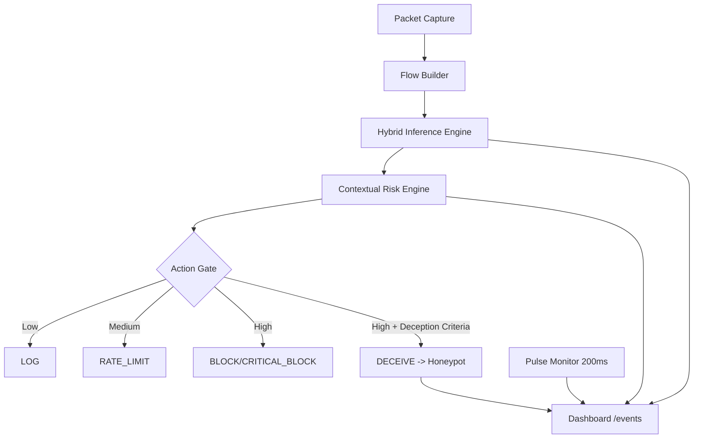

# INTELLIGENT SELF-DEFENDING NETWORK FRAMEWORK (ISDNF)

[](https://opensource.org/licenses/MIT)
[](https://www.python.org/downloads/)

ISDNF is a hybrid IDS+IPS prototype that combines flow-based ML detection, contextual risk scoring, and autonomous response controls (log, rate limit, block, deceptive redirection to honeypot).

This README reflects the current `main` branch implementation.

## Current Capabilities

- Real-time packet capture and flow extraction (`tcpdump`/`tshark` -> CSV features).
- Hybrid inference engine: DNN + optional HistGradientBoosting ensemble blend.
- Payload side-signal scoring for higher-confidence escalation.
- Contextual risk scoring with datacenter/infra de-escalation and local infrastructure immunity.
- Scan-aware heuristics using port diversity and incomplete handshake patterns.
- Evidence-gated enforcement to reduce false positives.
- Autonomous response actions: `LOG`, `RATE_LIMIT`, `BLOCK`, `CRITICAL_BLOCK`, `DECEIVE`.
- Deception node (`src/honeypot.py`) with attacker attribution support (`X-Forwarded-For`, `X-Real-IP`, `X-Original-Source-IP`).
- Optional `src_ip` hint for local demo/testing.
- Dashboard telemetry including SSE (`/stream`), honeypot summary/hits, and ML status (`/ml/stats`).

## High-Level Architecture



## Key Components

- `src/orchestrator.py`: Capture -> infer -> risk -> response SOC loop.
- `src/risk.py`: Multi-factor risk scoring and action mapping.
- `src/defender.py`: OS-level mitigation primitives (`pfctl`/`dnctl` or `nft`).
- `src/honeypot.py`: Deception web service and interaction logger.
- `src/dashboard/app.py`: Flask dashboard API + SSE + test utilities.
- `src/ml/high_perf_model.py`: Optimized inference, calibration, payload scoring.
- `src/packet_to_flow.py`: PCAP to CIC-style flow feature conversion.

## Prerequisites

- Python `3.10+`
- `tshark` and/or `tcpdump`
- macOS: `pfctl` and `dnctl` available for active mitigation
- Linux: `nft` for active mitigation

## Setup

```bash
git clone https://github.com/marmik/Network-Defence.git
cd Network-Defence
python3 -m venv .venv
source .venv/bin/activate
pip install -r requirements.txt
```

## Runbook

1. Start dashboard:

```bash
source .venv/bin/activate
python3 src/dashboard/app.py --host 0.0.0.0 --port 5010
```

2. Start honeypot:

```bash
source .venv/bin/activate
python3 src/honeypot.py
```

3. Start orchestrator in safe mode (dry-run):

```bash
source .venv/bin/activate
python3 src/orchestrator.py --iface en0 --duration 3
```

4. Start orchestrator with active enforcement:

```bash
source .venv/bin/activate
sudo .venv/bin/python3 src/orchestrator.py --iface en0 --duration 3 --no-dry-run --honeypot-ip 127.0.0.1 --honeypot-port 8080
```

## Dashboard Endpoints

- `GET /` main dashboard
- `GET /stream` server-sent events feed
- `POST /events` ingest pulse/alert/honeypot events
- `GET /alerts` aggregated alert history
- `GET /stats` cumulative counters + latest pulse
- `GET /ml/stats` model/training/drift summary
- `GET /honeypot` honeypot panel
- `GET /honeypot/hits` recent honeypot interactions
- `GET /honeypot/summary` honeypot aggregates
- `POST /honeypot/test` synthetic single honeypot hit
- `POST /honeypot/test-burst` synthetic hit burst
- `POST /purge` wipe runtime telemetry files

## Response Logic (Implemented)

- Scores are derived from anomaly, traffic intensity, persistence, and contextual metadata.
- Escalation above `RATE_LIMIT` is evidence-gated (strong IoCs or sustained behavior required).
- Private/internal addresses are handled conservatively unless strong attack IoCs are present.
- Known cloud/CDN infra receives de-escalation unless strong scan/payload IoCs are detected.
- Deception (`DECEIVE`) is reserved for high-confidence attacker profiles.

## ML Artifacts and Outputs

Typical files written under `models/` and `src/ml/plots/` include:

- `models/cic_model_v1.pt`
- `models/cic_scaler_v1.joblib`
- `models/cic_label_encoder_v1.joblib`
- `models/cic_features_v1.joblib`
- `models/cic_hgb_model_v1.joblib` (optional)
- `models/cic_calibration_v1.joblib`
- `models/cic_calibration_v2.joblib`
- `models/cic_priors_v1.joblib`
- `models/cic_decision_metadata_v1.joblib`
- `src/ml/plots/training_summary.json`

## Notes for Local and Kali Testing

- If everything runs on one host, honeypot hits may appear from localhost unless source attribution headers or explicit source hints are used.
- For realistic attacker identity, run traffic from a separate Kali machine and target the defender host IP directly.
- Use the dashboard synthetic endpoints for UI verification independent of network lab setup.

## Kali Attack Simulation Playbook (Authorized Lab Only)

Run these only in your own lab or an environment where you have explicit authorization.

Set the defender host once on Kali:

```bash
export DEFENDER_IP="192.168.1.10"
```

Quick verify target reachability:

```bash
ping -c 3 "$DEFENDER_IP"
curl -m 3 "http://$DEFENDER_IP:8080/health"
```

1. Recon and port scan (should trigger scan IoCs)

```bash
sudo nmap -sS -Pn -T4 -p 1-2000 "$DEFENDER_IP"
```

Expected ISDNF behavior:
- Higher `unique_ports_count` and `incomplete_handshakes`.
- Alert trend from `LOG`/`RATE_LIMIT` toward `BLOCK` or `CRITICAL_BLOCK`.

2. Fast repeated scan burst (for faster escalation)

```bash
for i in {1..5}; do
    sudo nmap -sS -Pn -T5 -p 21-1024 "$DEFENDER_IP"
done
```

Expected ISDNF behavior:
- Threat memory increases persistence.
- Stronger chance of `CRITICAL_BLOCK` or `DECEIVE` in active mode.

3. Service/version probing (recon + app probing)

```bash
sudo nmap -sV -sC -Pn -p 80,443,8080 "$DEFENDER_IP"
```

Expected ISDNF behavior:
- Recon visibility in alerts with moderate-to-high risk.
- Usually `LOG` or `RATE_LIMIT`, possibly escalates if combined with scans.

4. HTTP brute-force style pressure against honeypot endpoint

```bash
hydra -l admin -P /usr/share/wordlists/rockyou.txt -s 8080 "$DEFENDER_IP" http-post-form "/:user=^USER^&pass=^PASS^:F=AUTHENTICATION FAILED" -t 8 -V
```

Expected ISDNF behavior:
- Frequent honeypot hits in `/honeypot/hits` and `/honeypot/summary`.
- If orchestrator sees enough malicious support, can move toward `DECEIVE`/`BLOCK`.

5. Web fuzzing/noisy probing (path discovery)

```bash
gobuster dir -u "http://$DEFENDER_IP:8080" -w /usr/share/wordlists/dirb/common.txt -t 40
```

Expected ISDNF behavior:
- High request diversity and repeated probing patterns.
- Typically `RATE_LIMIT`/`BLOCK` depending on intensity and cycle timing.

6. Slow HTTP pressure pattern (low-and-slow style)

```bash
slowhttptest -c 200 -H -i 10 -r 50 -t GET -u "http://$DEFENDER_IP:8080/" -x 24 -p 3
```

Expected ISDNF behavior:
- Elevated persistence and abnormal connection behavior.
- May start as `LOG`/`RATE_LIMIT` and escalate over repeated cycles.

7. Optional packet flood test (only in isolated lab)

```bash
sudo hping3 -S -p 8080 --flood "$DEFENDER_IP"
```

Expected ISDNF behavior:
- Rapid spike in PPS/BPS pulse.
- Strong chance of `BLOCK`/`CRITICAL_BLOCK` in active mode.

How to watch detections live from defender host:

```bash
tail -f alerts.json
```

```bash
curl -s http://127.0.0.1:5010/honeypot/summary | jq
```

```bash
curl -s http://127.0.0.1:5010/stats | jq
```

Demo-safe fallback (no attack traffic required):

```bash
curl -X POST http://127.0.0.1:5010/honeypot/test
curl -X POST http://127.0.0.1:5010/honeypot/test-burst -H 'Content-Type: application/json' -d '{"count": 10}'
```

## Project Status

Current branch includes post-V13 improvements (hybrid ensemble inference, stricter evidence-gated mitigation, improved infrastructure de-escalation, honeypot attribution enhancements, and richer dashboard telemetry).

Maintainer: Marmik
